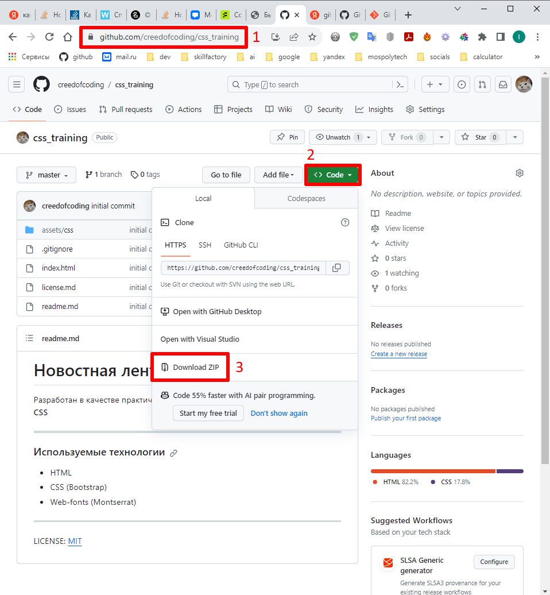

# Лэндинг новостной ленты

Разработан в качестве практического задания от Skillfactory из модуля **Базовый CSS**

---

### Используемые технологии

* HTML
* CSS
* Web-fonts (Montserrat)

---

### Как открыть/запустить

1. Зайти на GitHub в [репозиторий проекта](https://github.com/creedofcoding/css_training).
2. Нажать на Code
3. Нажать на Download ZIP

---

LICENSE: [MIT](./license.md)